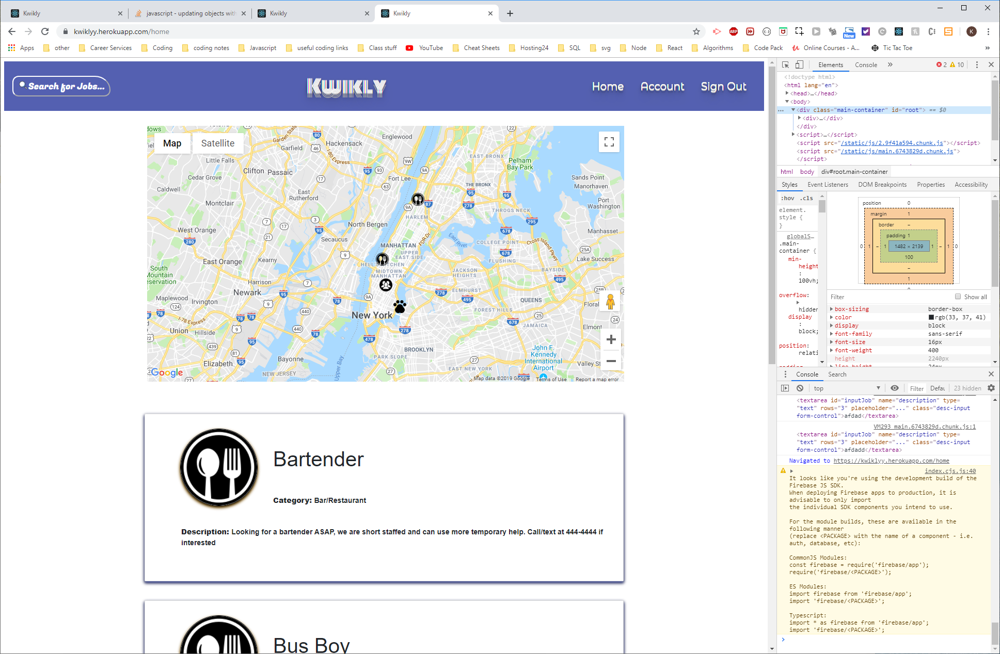

# Project-3 Kwikly
## Overview
This app was built with React. 
 
Users can create an account for either an employee or employer. Employers can post jobs.  
 
Users can see the jobs from the maps and select them.

## Instructions
[Visit this link to try](https://kwiklyy.herokuapp.com/)
 

### To Use
Start by making an account!

 
## Built With
* node.js
* JavaScript
* HTML
* CSS
* CSS Grids
* [Bootstrap 4](https://getbootstrap.com/)-for CSS library
* [Create React App](https://github.com/facebook/create-react-app)-for React
* [express from npm](https://www.npmjs.com/package/express)
* [axios](https://www.npmjs.com/package/axios)-for HTTP requests from node
* [mongoose](https://www.npmjs.com/package/mongoose)-for database
* [React Google Maps](https://www.npmjs.com/package/react-google-maps)-for map
* [Google Map API](https://www.npmjs.com/package/react-google-maps)-for map
* [mongoose](https://www.npmjs.com/package/mongoose)-for database
* [animate.css](https://daneden.github.io/animate.css/)-for animations and react-toastr
* [react-toastr](https://tomchentw.github.io/react-toastr/)-for notifications
* [React Gravatar](http://kyleamathews.github.io/react-gravatar/)-for account images
* [Firebase Authentication](https://firebase.google.com/docs/auth)-for user authentication

## Authors
* Daniel Lazenberry
* John Russo
* Abigail Ettore
* Kayleigh Starr